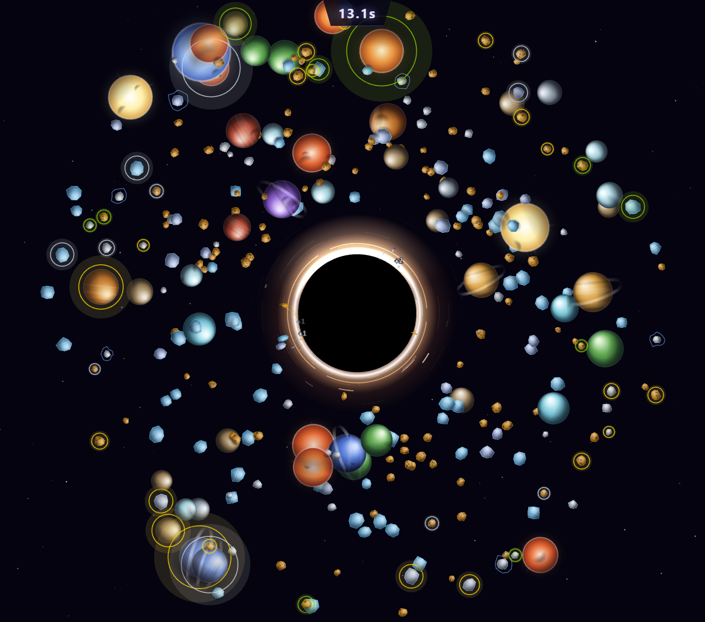

# Accretion

A browser incremental game about feeding a black hole. You start as a newly collapsed stellar-mass singularity chewing on space rocks and end enthroned at the center of a galaxy, devouring everything. Inspired by [A Game About Feeding A Black Hole](https://store.steampowered.com/app/3694480/A_Game_About_Feeding_A_Black_Hole/) by Aarimous, rebuilt from scratch with its own design.

Move your Breaker over celestials to crack them, collect matter, buy upgrades, and grow. The black hole never shrinks. It only feeds.



## Features

- **Timed feeding sessions** — short, escalating runs where every Breaker tick counts, ending in a full stat report of everything you destroyed
- **Four mass stages** — grow from *Stellar-Mass* through *Intermediate-Mass* and *Supermassive* to *Galactic Core*; each stage unlocks new prey and new upgrade branches
- **A consumption ladder** — rocks and metal asteroids, then dwarf planets to ringed gas giants, then red dwarfs to blue giant stars
- **A 113-node upgrade tree** — ten branches radiating from the hole itself: Breaker power, chain lightning, planets, stars, golden, radioactive, moons, comets, lasers, orbs. Every node is obtainable in a single playthrough
- **Affixes and gimmicks** — electric entities that chain lightning, golden bounty targets, radioactive fallout zones, moons that orbit and buff your Breaker, comet flybys with crit rewards, stars that fire screen-crossing laser blasts when broken, supernovae, bouncing orb projectiles
- **An ever-denser field** — spawn-density upgrades, respawn-on-kill, and per-stage escalation turn the late game into total mayhem
- **Two-ledger economy** — *matter* (your score, spend it on upgrades) and *mass* (the hole itself, monotonic — it never decreases, ever)
- **Seeded procedural art** — every rock, planet, and star is a generated texture; no two alike, no asset files
- **A victory to chase** — reach galactic mass and the game tells you what you have become; keep feeding after
- **Runs anywhere** — responsive rendering at any window size; landscape play on mobile

## Getting Started

Requires [Node.js](https://nodejs.org/) v22+.

```bash
git clone git@github.com:Guappa/accretion.git
cd accretion
npm install
npm run dev
```

Open [http://localhost:5173](http://localhost:5173) and click **Begin Feeding**.

## Scripts

| Command | Purpose |
|---|---|
| `npm run dev` | Dev server with hot reload |
| `npm test` | Test suite (Vitest) |
| `npm run lint` | ESLint |
| `npm run build` | Typecheck + production build to `dist/` |

## Tech Stack

- **Phaser 4** — game rendering
- **TypeScript (strict)** + **Vite** — language and tooling
- **Vitest** — tests for every pure-logic system
- Plain HTML/CSS DOM overlay for menus, HUD, and the upgrade tree — no UI framework, no runtime dependencies beyond Phaser

## Architecture

Game logic lives in Phaser-free TypeScript systems (spawning, gravity, the Breaker, gimmicks, the session director) that communicate exclusively through a typed event bus and are ticked by a single scene. The render layer diffs entity state into pooled sprites and overlays each frame. Every tunable number — tick rates, spawn curves, stage thresholds, prices, colors — lives in `src/config/`, so the whole game balances from data.

## License

Educational and personal use. Go buy [the original](https://store.steampowered.com/app/3694480/) — Aarimous earned it.
